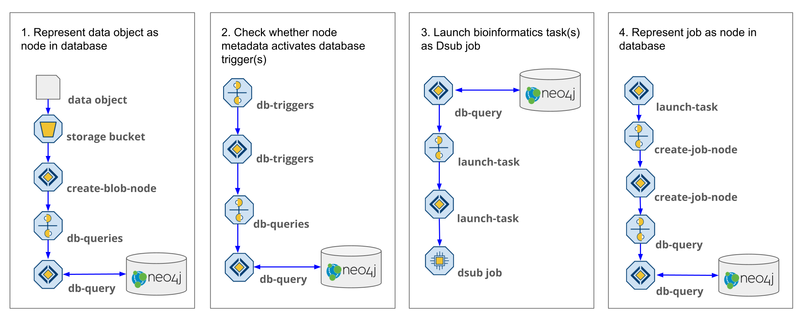
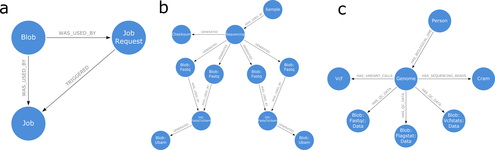

# Application architecture

The Trellis application logic is implemented in [serverless functions](https://github.com/StanfordBioinformatics/trellis-mvp-functions) so that it can automatically scale to meet the demands of large-scale analyses. Serverless functions are short pieces of code that define the logic to perform a single operation. The execution of serverless functions is handled by the cloud provider, so there is no need to provision servers or configure auto-scaling policies. They are useful for parallelizing small operations across distributed computing systems because each function runs independently, without relying on stateful information from other parts of the system. This allows Trellis services to rapidly scale up or down, across multiple machines, to meet the demands of thousands of jobs running simultaneously. Because they are stateless, the services use a message broker to communicate with each other and register all system updates in the graph database.

​​Trellis relies on four core functionalities that work in tandem to manage data and jobs. The first is to represent data objects as nodes in the graph database. This occurs when data objects are added to or updated in a cloud storage bucket. The next step determines whether any processing needs to be performed on the object. This is done by comparing the metadata of the object against the conditions for triggering processing tasks. If a task is triggered, the third step is to query the database for the job inputs and send them to a function to launch it. Finally, once the job has been launched, it is recorded as a node in the database. These four functionalities represent the core loop used by Trellis to manage and track all data objects and computing tasks in a graph database, which can be queried for the purposes of finding relevant data or process optimization.

## Creating nodes from data objects
Trellis is an event-driven system where the primary events are new data objects being added to a storage bucket that is monitored by Trellis (Step 1). Creation of a data object activates a cloud storage trigger which sends the metadata of the object to the create-blob-node function (Step 2). The function parses the object metadata from its cloud storage path, or an associated JSON object, and creates a database query that will add a reference to the object as a node in the database. It sends the query via a message broker, such as Cloud Pub/Sub, to the db-query function which will communicate it to the Neo4j graph database (Step 3).

## Activating database triggers
Trellis automatically launches jobs based on metadata. When a node is added or updated in the database, the database query returns the properties of the node to the db-query function (Step 4). These metadata properties are sent to the db-triggers function to determine whether any subsequent operations should be initiated (Step 5). The operations of Trellis are controlled by database triggers which are managed by db-triggers. These operations consist primarily of two steps, adding relationships between nodes in the database and triggering bioinformatics tasks. Each trigger has two functional components, that is, a set of metadata conditions that must be met to activate the trigger, and a database query that will run on activation to get the inputs for the triggered operation. When node properties are received, they are checked against the conditions for activating each trigger. If the conditions are met, the corresponding database query is sent to db-query to be processed by the database (Step 6).

## Running database trigger queries
The graph database acts as the application hub, tracking metadata and controlling Trellis operations. Whereas the conditions for activating a database trigger determine whether the content of a node is right for launching an operation, the trigger query determines whether the context of the node is appropriate. Nodes are connected by relationships describing data provenance or their functional domain. Trigger queries traverse these relationships to determine whether the graph state meets the conditions for launching an operation (Step 7). If the conditions are met, the query returns the inputs necessary to launch the job and the db-query function sends them to the appropriate launcher function (Step 8).

Triggers use relationships to serve a variety of purposes. To avoid launching duplicate jobs, queries for launching bioinformatics tasks check for existing job request nodes before requesting a job (a). Provenance relationships are used to query that an unaligned BAM object has been generated for each sequencing group, before launching GATK variant calling. The query finds all the unaligned BAMs belonging to unique read groups and compares that number to a property stored in the delivery manifest/checksum node, to ensure that all groups are accounted for (b).

In the case where we store data indefinitely on the cloud, storage represents our biggest cost. And as the intermediate objects generated during variant calling often exceed 300 GB in size, we implemented a function to delete these objects after variant calling. Before initiating this process, the trigger query starts from the genome node and traverses functional domain relationships to determine that all essential genomic data types (Cram, gVCF, FastQC, Flagstat, Vcfstats) have been generated (c). In this way, different relationship patterns increased the connectedness of our data and improved our ability to automatically make functional decisions about how to process them.

## Creating job nodes
Each bioinformatics task is initiated by a different function, whose single purpose is to launch that task. Trellis configures the jobs and relies on separate task/workflow managers to handle running them (i.e. provisioning virtual machines, running the bioinformatics application(s), transferring input/output objects). The function takes the inputs specified from the database query results, transforms them into a job configuration, and submits them to the task manager (Fig. 1, step 9). We used the Docker-based Dsub task manager to run QC jobs and Cromwell to run the germline variant-calling pipeline. We chose Cromwell for the latter, because the $5 GATK pipeline that we used for variant calling was already defined in Cromwell’s native Workflow Definition Language (WDL) and the pipeline had already been optimized to run on Google Cloud using Cromwell.

Once a job has been submitted, the launcher sends the configuration data to the create-job-node function so that it can be added as a node in the database database (Fig. 1, step 10). Job nodes include all the information necessary to replicate them, such as the Docker image11, computing environment configuration, input path(s), and command used to run the job. These metadata are translated into node properties and incorporated into a node creation query that is sent to the db-query function to be processed (Fig. 1, step 11). Once the job node has been added to the database, it will activate triggers to relate the node to the object nodes that were used as inputs. Similarly, as outputs are generated from the job, they will be linked to the job node via provenance relationships.
