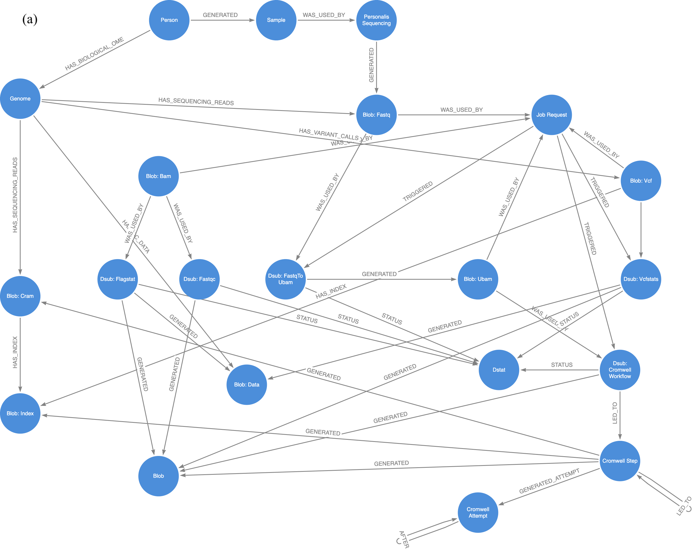
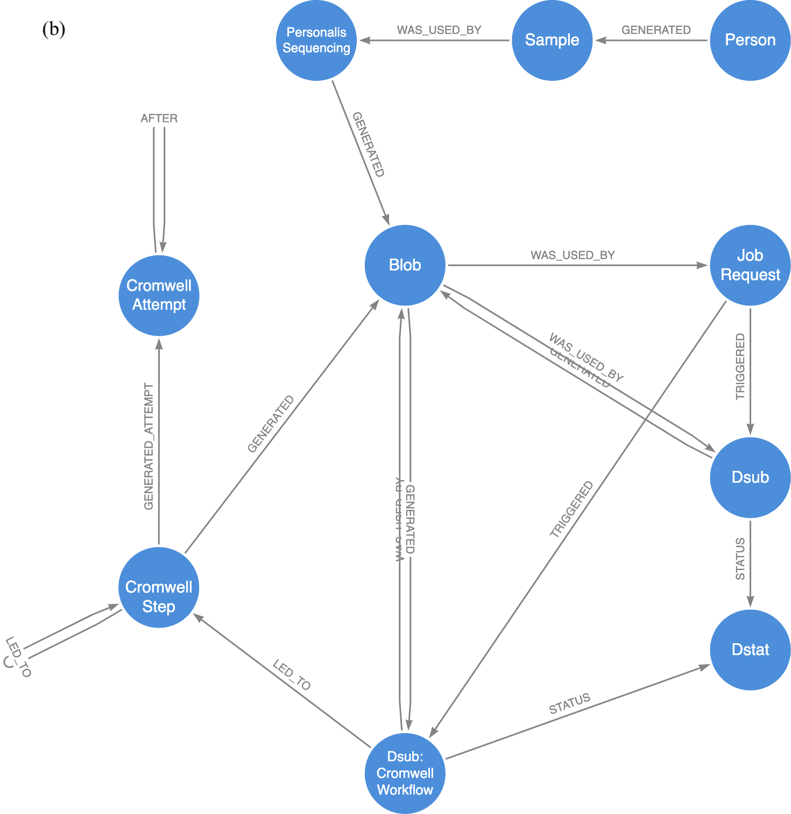
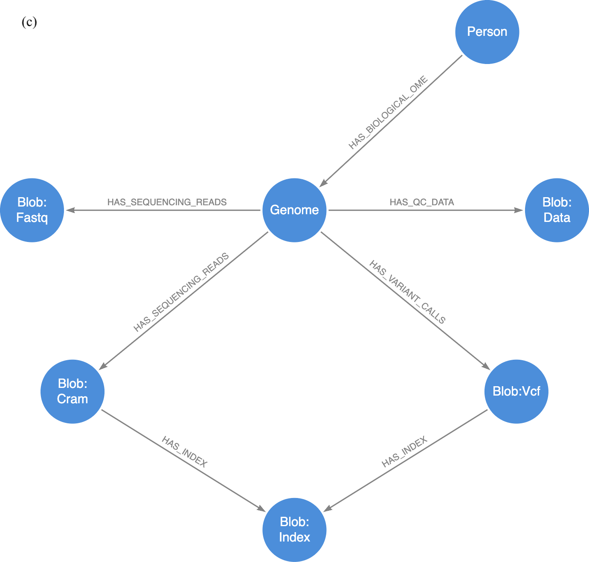

# Data model
The "brain" of Trellis is a Neo4j graph database used to track metadata associated with all jobs and data objects. Jobs and data are represented as nodes and connected by relationships. Both nodes and relationships can be labelled with strings and populated with key:value properties. We treat labels as categories of entities where each label corresponds to a particular set of properties. In cases where a node can fit multiple categories, we assign multiple labels to that node.

## Relationship patterns
One advantage of using a graph database is that relationships are first-class citizens. This makes it easy to continue adding new relationships and relationship types to existing nodes; a process that is valuable in the context of biomedical data, where the goal is to identify connections between different biological domains and functional elements. 

 

In Trellis, nodes are connected using two relationship patterns, one that describes data provenance (blue relationships), and one that relates data to functional research domains (orange relationships). **Provenance relationships** are designed to improve reusability of data by clearly tracing the lineage of every data object to a biological sample of origin. **Functional domain relationships** are designed to simplify the process of querying data most relevant to a particular research domain; in this case, the human genome.

## Graph schema
### Full

### Data provenance schema

### Genome functional domain schema

