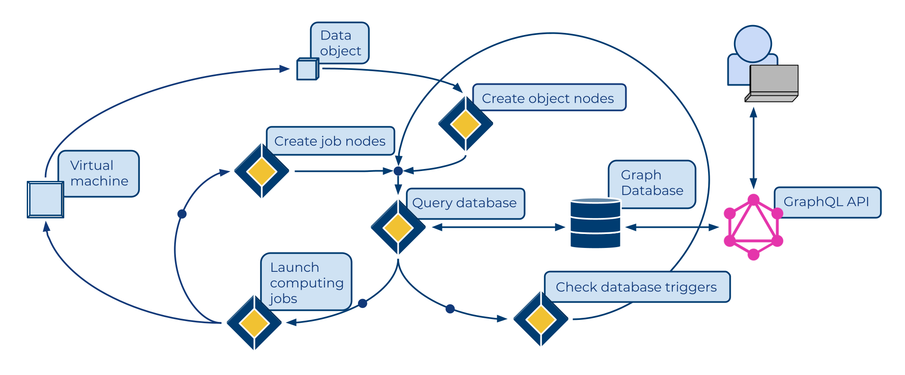

.. Trellis documentation master file, created by
   sphinx-quickstart on Fri Aug 13 11:22:01 2021.
   You can adapt this file completely to your liking, but it should at least
   contain the root `toctree` directive.

Trellis data management framework for biomedical research
===================================

Biomedical studies have become larger in size and yielded large quantities of data, yet efficient data processing remains a challenge. Trellis is a cloud-based data and task management framework that completely automates the process from data ingestion to result presentation, while tracking data lineage, facilitating information query, and supporting fault-tolerance and scalability. Using a graph database to coordinate the state of the data processing workflows and a scalable microservice architecture to perform bioinformatics tasks, Trellis has enabled efficient variant calling on 100,000 human genomes collected in the `VA Million Veteran Program <https://www.research.va.gov/mvp/>`_. 

GitHub: `https://github.com/StanfordBioinformatics/trellis-mvp-functions <https://github.com/StanfordBioinformatics/trellis-mvp-functions>`_.

.. toctree::
    :maxdepth: 2
    :caption: Contents:

    data-model.md
    application-architecture.md
    deployment.md
    security.md
    source.md
    v1-3-update.md

Indices and tables
==================

.. * :ref:`genindex`
.. * :ref:`modindex`
* :ref:`search`
