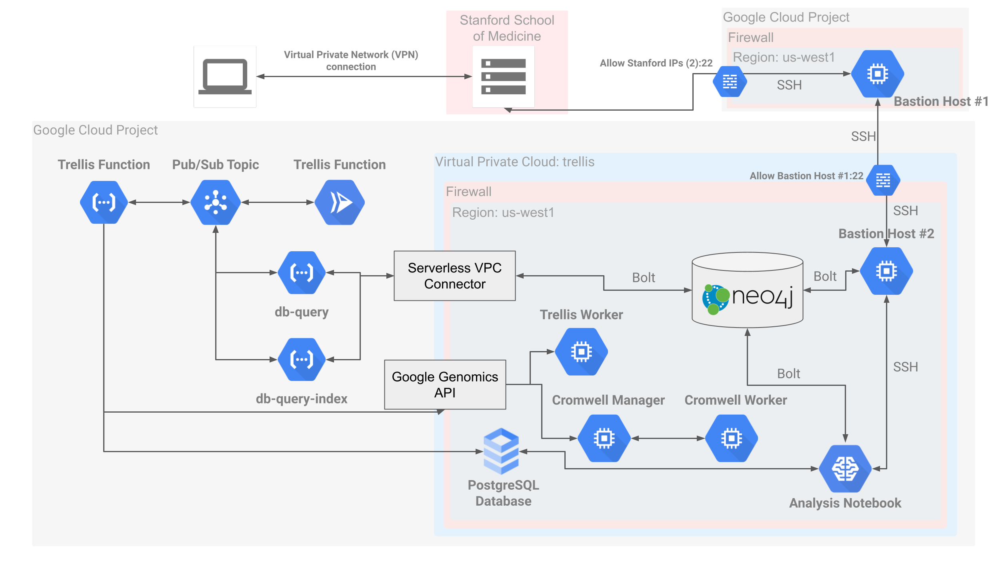

# Security
 

Maintaining data security is always important when handling genomic data which has the potential to identify people and their phenotypes. In building Trellis, we followed the security guideline for computing genomics data on the cloud14. In addition, we have tried to minimize security risk by running Trellis on a virtual private cloud (VPC) network. Virtual machines operate with only internal IP addresses and serverless functions communicate using an internal message broker to avoid exposing HTTP endpoints. The Neo4j database has an external IP address to allow developer access, but this access is tightly controlled through IP-specific firewall rules. With respect to the overall computing environment, Google Cloud, where Trellis is currently implemented, is compliant with HIPAA, FEDRAMP, and FISMA-moderate Authorization, and data on Google Cloud is encrypted at all times.