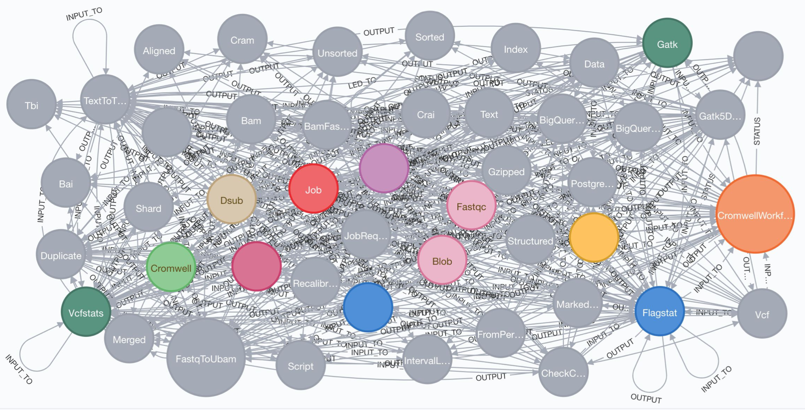
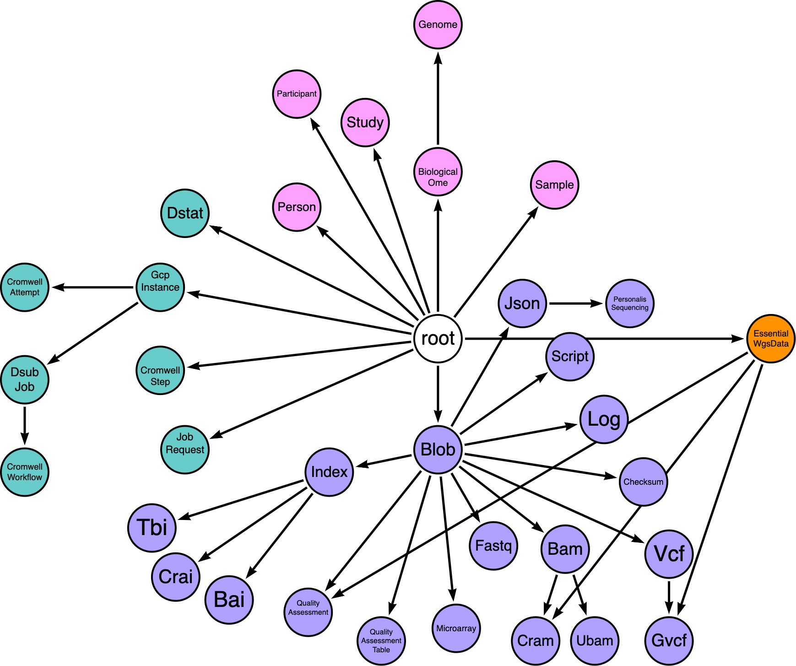
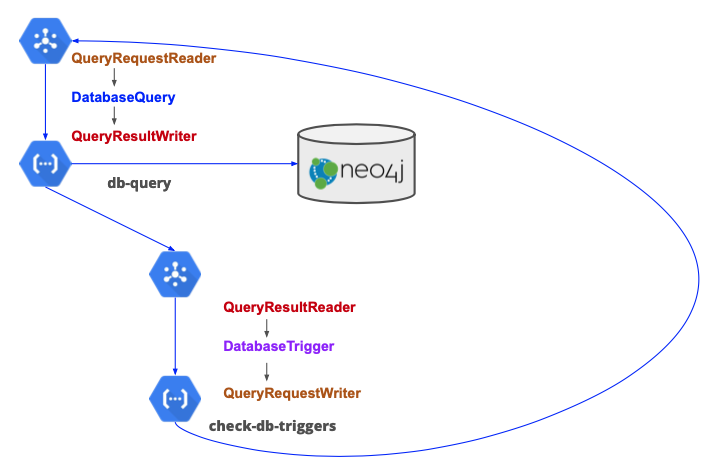
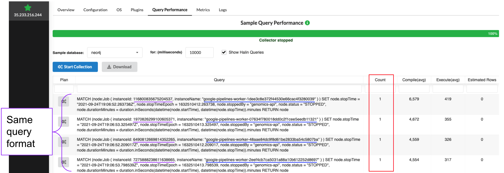
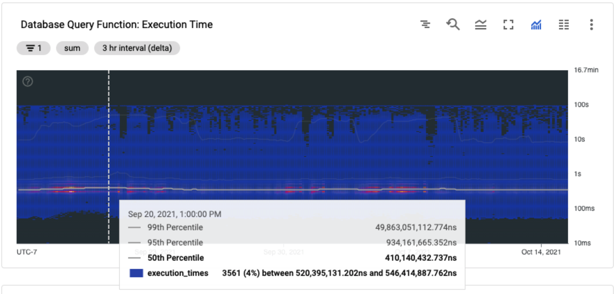
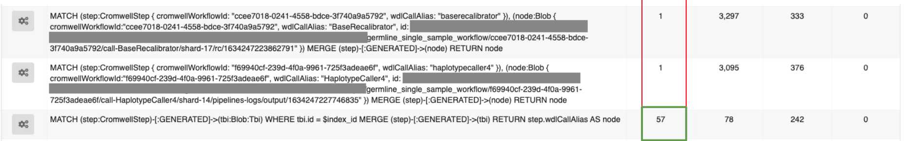

# Version 1.3 Update (In-dev)
These notes describe changes being made in the upcoming Trellis v1.3 update expected for release at the end of March, 2022.

## Using a node label taxonomy
Neo4j is a graph database that supports adding multiple labels and properties to each node in the database. My initial approach to labelling is that "more is better" because the more labels that are applied to a node, the richer the data, and the more sophisticated we can be in making decisions regarding that node.

I identified several issues with this approach:
1. Adding more than (4) node labels apparently decreases database performance because more space has to allocated for storage. Read more from David Allen on graph modeling labels: <https://medium.com/neo4j/graph-modeling-labels-71775ff7d121>.
2. Creating, identifying, or comprehending a database schema when each node can have 4+ labels is almost impossible. For reference, see the schema visualization I generated from a simpler & earlier version of the 
 Trellis database, using the Neo4j `db.schema` command:

3. There seems to be a consensus between graph database professionals and groups publishing bioinformatics graph models that a single-model approach is the way to go. I see plenty of recommendations for single labels and I rarely see published examples using multiple labels.

So, I wanted to switch to a single-label model to simplify our schema without losing the richness of information offered by using multiple labels. For instance, I want users to know that nodes labeled "Bai" represent a specific type of index that is a data object stored in cloud storage. Using multiple labels, I would label this node :Bai:Index:Blob.

To do this using only a single label I opted to define a hierarchical taxonomy where each label inherits the properties of its parent.

In this **[arrows](https://arrows.app)** diagram, purple represents the domain of data objects, teal the domain of tasks, and pink the domain of biomedical studies.

Another potential benefit of using a taxonomy is that Neo4j has a **[neosemantics](https://neo4j.com/labs/neosemantics/)** for performing semantic inference on hierarchically structured categories. So in the future, if I want to apply an operation to all sequencing reads data, I could create a :SequencingReads label and then make :Fastq, :Bam, and :Cram all children of that label. That way, even if none of the nodes are labelled :SequencingReads, the database can infer that relationship and get all the children. I think. I still haven't tried it but I'm look forward to finding a use case for it.

## Using standard message classes
The application logic of Trellis is distributed among multiple serverless functions that operate independently. These functions coordinate operations by sending messages to each other via the **[Cloud Pub/Sub](https://cloud.google.com/pubsub)** message broker availabe on Google Cloud Platform.

A potential point-of-failure in the current Trellis release is that each function formats messages according to its own logic. I essentially copy-pasted the same "format_pubsub_message()" method across all of the functions, but there is the potential for differences in formatting/structure to arise because every function has a separate instance of the method code. To address this, I created a **[trellisdata](https://pypi.org/project/trellisdata/)** Python package that implements standard classes for reading and writing different kinds of Trellis messages.

These query-based classes are enough to handle messages in the core Trellis functional loop of running database queries and interpreting results to see if they trigger any further queries.

## Switching to the Neo4j database driver
My primary reason for switching from [py2neo](https://py2neo.org/2021.1/#) to the official [Neo4j driver](https://neo4j.com/docs/api/python-driver/current/) was to support parameterized queries. Parameterized queries allow you to define queries using variables to represent property values and then supply the values at query runtime. This has several benefits:

1. It allows Neo4j to [cache](https://neo4j.com/developer/kb/understanding-the-query-plan-cache/) and reuse the same query plan for queries with the same structure but different property values.
2. And most importantly to me, it allows for aggregation of performance metrics using [Halin](https://neo4j.com/labs/halin/).
3. It allows me to easily return node and relationship using the [Graph class](https://neo4j.com/docs/api/python-driver/current/api.html#graph).

### Aggregating query performance metrics

I had previously been forming queries using string concatenation in my Python application and then passing the queries to Neo4j. Even though lots of queries followed the same plan, Neo4j didn't recognize them as the same because I hadn't parameterized them. So, when I would open the Query Performance tab in Halin every query would be listed as a single entry.

This was an issue because I noticed that my overall query performance had been slowly degrading as I had continued to update the database model and add more data, and I wasn't sure why. This screenshot from my [Cloud Monitoring](https://cloud.google.com/monitoring) dashboard shows a heatmap of execution times for the db-query Trellis function responsible for processing database queries. Here the average execution is about 410ms, up from 350ms a few months prior. You can also see that there are plenty of queries that take between 1 and 100 seconds (timeout), which is also an issue I want to address. But without being able to aggregate query performance metrics it's hard to identify which queries are performing poorly.

Here you can see an example of where I converted a single query to use parameters and was able to aggregate execution metrics over 57 instances of the query. It also made it easier for me to read and interpret the query by replacing long property values with shorter and more informative variable names.

### Returning node and relationship information

## Simplifying database triggers
### Supporting Node & Relationship Triggers
## Using parameterized queries
### Stored queries
### Dynamically generating queries
