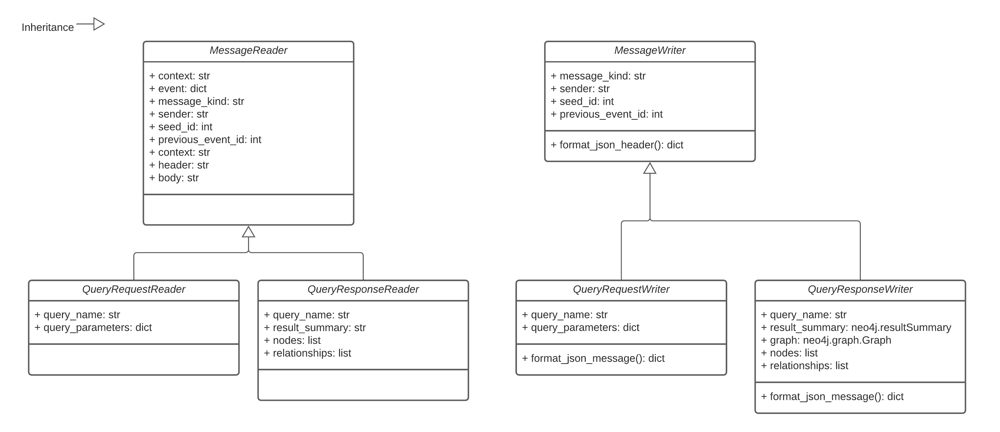

# Version 1.3 Update (In-development)
These notes describe changes being made in the upcoming Trellis v1.3 update expected for release at the end of March, 2022.

## Using a node label taxonomy
Neo4j is a graph database that supports adding multiple labels and properties to each node in the database. My initial approach to labelling is that "more is better" because the more labels that are applied to a node, the richer the data, and the more sophisticated we can be in making decisions regarding that node.

I identified two issues with this approach:
	1. Adding more than (4) node labels apparently decreases database performance because more space has to allocated for storage. Read more from David Allen on node labels: https://medium.com/neo4j/graph-modeling-labels-71775ff7d121.
 	2. Creating, identifying, or comprehending a database schema when each node can have 4+ labels is almost impossible. For reference, see the schema visualization I generated from a simpler & earlier version of the 
 Trellis database, using the Neo4j `db.schema` command:

	

	3. There seems to be a consensus between graph database professionals and groups publishing bioinformatics graph models that a single-model approach is the way to go. I see plenty of recommendations for single labels and I rarely see published examples using multiple labels.

So, I wanted to switch to a single-label model to simplify our schema without losing the richness of information offered by using multiple labels. For instance, I want users to know that nodes labeled "Bai" represent a specific type of index that is a data object stored in cloud storage. Using multiple labels, I would label this node :Bai:Index:Blob.

To do this using only a single label I opted to define a hierarchical taxonomy where each label inherits the properties of its parent.

Another potential benefit of using a taxonomy is that Neo4j has a [neosemantics](https://neo4j.com/labs/neosemantics/) for performing semantic inference on hierarchically structured categories. So in the future, if I want to apply an operation to all sequencing reads data, I could create a :SequencingReads label and then make :Fastq, :Bam, and :Cram all children of that label. That way, even if none of the nodes are labelled :SequencingReads, the database can infer that relationship and get all the children. I think. I still haven't tried it but I'm look forward to finding a use case for it.

## Using standard message classes
The application logic of Trellis is distributed among multiple serverless functions that operate independently. These functions coordinate operations by sending messages to each other via the [Pub/Sub](https://cloud.google.com/pubsub) message broker availabe on Google Cloud Platform.

A potential point-of-failure in the current Trellis release is that each function formats messages according to its own logic. I essentially copy-pasted the same "format_pubsub_message()" method across all of the functions, but there is the potential for differences in formatting/structure to arise because every function has a separate instance of the method code. To address this, I created a [trellisdata](https://pypi.org/project/trellisdata/) Python package that implements standard classes for reading and writing different kinds of Trellis messages.

These query-based classes are enough to handle messages in the core Trellis functional loop of running database queries and interpreting results to see if they trigger any further queries.

## Switching to the Neo4j database driver
## Simplifying database triggers
### Supporting Node & Relationship Triggers
## Using parameterized queries

